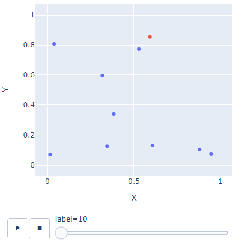
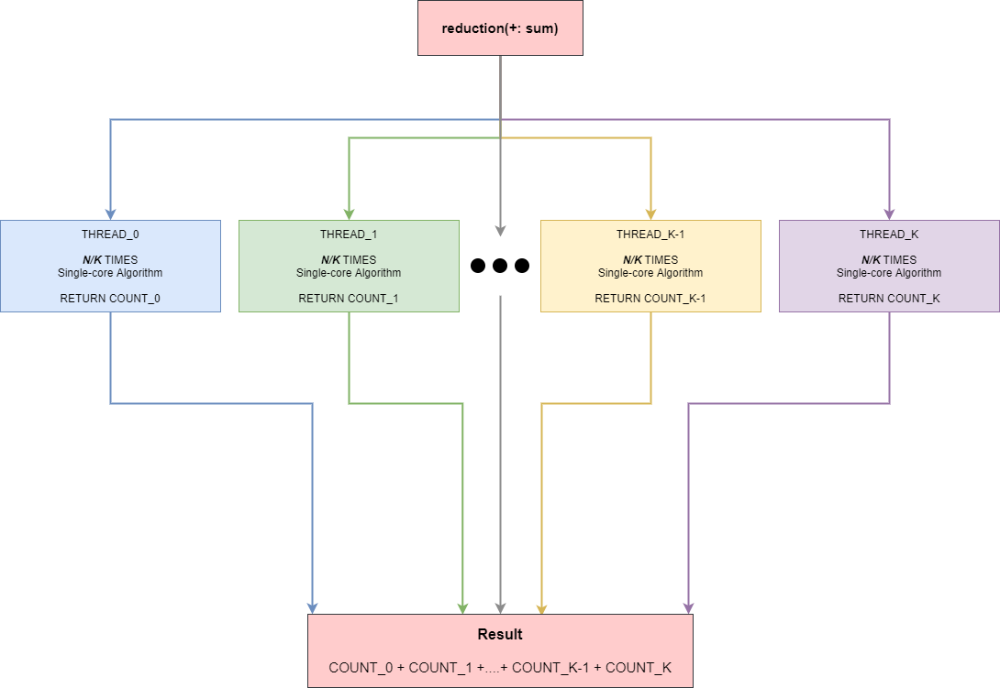
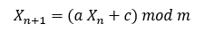
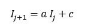
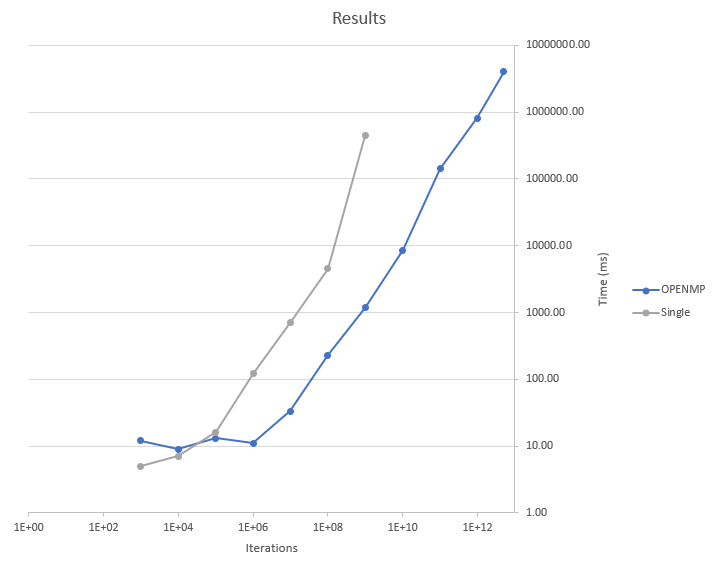
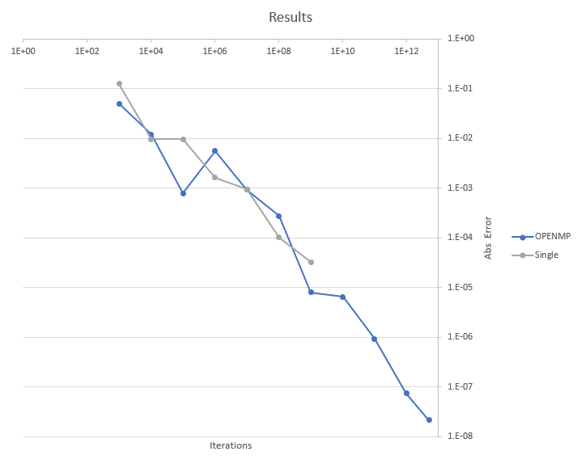

# Calculating Pi (π) With Monte Carlo Using Parallel Computing With OpenMP and C

---

As published in [betterpramming.pub](https://betterprogramming.pub/calculating-pi-%CF%80-with-monte-carlo-using-parallel-computing-with-openmp-and-c-2b3a357f0f78) by Ilias Xenogiannis


Photo by [Magnus Engø](https://unsplash.com/@magnusengo?utm_source=medium&utm_medium=referral) on [Unsplash](https://unsplash.com/?utm_source=medium&utm_medium=referral)

Pi’s calculation is a computational problem of great importance that’s attracted many to attempt to calculate it with the best possible accuracy.

There are many methods for doing it, but we will use Monte Carlo to calculate pi (π).

We’ve chosen the Monte Carlo method because it’s simple and can be classified as “[embarrassingly parallelizable](https://www.microsoft.com/en-us/research/publication/optimization-monte-carlo-efficient-embarrassingly-parallel-likelihood-free-inference/),” as these algorithms have been characterized in the literature. It’s embarrassingly parallelizable because it can break into smaller processes without any data sharing — an issue that would complicate the process.

The Monte Carlo method for calculating π has two variants:

- The unit-circle and unit-square method
- Integral calculation through the calculation of the average of functions

We’ll choose the first method.

The logic behind this method is that we create random points within the unit square. Then we calculate the ratio of the points that are inside the unit cycle and calculate the ratio of these points against the total.



## 

If you want to learn more about the unit-circle technique and Monte Carlo in general, [this article](https://medium.com/cantors-paradise/estimating-π-using-monte-carlo-simulations-3459a84b5ef9) is a great resource.

First, I applied the algorithm without parallelism to have these times as a reference benchmark.

The logic behind the algorithm is elementary. We perform a large number of iterations, and we request random values for the *x* and *y* coordinates. At the end, we calculate the ratio of the points in and out of the requested area. After multiplying the ratio by 4, we have the pi (π).

```c
#include <stdlib.h>
#include <stdio.h>
#include <math.h>


#define SEED 123456
#define N 1000000000

int main()
{
   
    int count=0; 
    double pi;

    srand(SEED);

    //Running the "simulation" for N times
    for (int i=0; i<N; i++) {
        
        //Getting the coordinates y,x ε [0,1]
        double x,y;
        x = (double)rand()/RAND_MAX;
        y = (double)rand()/RAND_MAX;

        //Checking if in unit circle
        if (x*x+y*y <= 1)
            count++;
    
    }

    //Calcuting the ratio and as a result the pi
    pi=(double)count/N*4;

    printf("Single : # of trials = %14ld , estimate of pi is %1.16f AND an absolute error of %g\n",N,pi,fabs(pi - M_PI));
            
    return 0;
}
```

The simplicity of the algorithm allows us to parallelize the iteration part very efficiently using the reduction technique.



There’s only one significant change that we have to implement in the parallel code.

The traditional way of creating random numbers doesn’t work in parallel effectively. The function `rand()`, which we used in the single-core version, is not thread-safe; therefore, we can’t execute this part in parallel.

We chose to create random numbers with the [linear congruential generator](https://translate.google.com/translate?hl=en&prev=_t&sl=auto&tl=en&u=https://en.wikipedia.org/wiki/Linear_congruential_generator) algorithm instead of `rand()`.

This formula can express the algorithm:



But especially in C, if we multiply two long numbers of 32 bits, we get the least significant digits of the multiplication result, 64 bits (“Numerical Recipes” by William H. Press, Chapter 7: Random Numbers).

Therefore, we don’t need to use *mod m.* The formula can be expressed as:



According to the book, the numbers we should choose for the algorithm are *a=*1103515245 and *c=*12345, suitable for C99.

The following code is the updated version of our program containing the changes we made to random numbers generating and all of the necessary code for the OpenMP parallelization.

```c
#include <stdlib.h>
#include <stdio.h>
#include <math.h>
#include <limits.h>
#include <omp.h>

#define SEED 123456
#define N 5000000000000

unsigned int seed = 676767676 ; 


//Random number generator with linear congruential generator
double randUint( long i ){
    
	seed = seed * 1103515245 + 123456;
    
    return seed / (double)UINT_MAX ;
}


int main()
{
   
    long count=0;
    double pi;
    
    //Init Parallelazation with reduction techinue
    #pragma omp parallel for reduction(+: count)
    for (long i=0; i<N; i++) {

        
        //Getting the coordinates y,x ε [0,1]
        double x,y;
        x = randUint(i);
        y = randUint(i);

        //Checking if in unit circle
        if (x*x+y*y <= 1)
            count = count + 1;

    
    }

    //Calcuting the ratio and as a result the pi
    pi=((double)count/(double)N) * 4.0;

    printf("OpenMP : # of trials = %14ld , estimate of pi is %1.16f AND an absolute error of %g\n",N,pi,fabs(pi - M_PI));

    return 0;
}
```

# Results

We executed the code on an eight-core machine for different numbers of iterations to get the code’s speed up.

## Time 



## Error



We observe that for a small number of iterations, the single-core solution is better, which we should expect. The parallelization of a program has a little overhead for managing the threads. As the number of iterations becomes bigger and bigger, this overhead is insignificant, and the parallelization of the program is unbelievably efficient.

# Conclusion

Parallel computing is critical — as Moore’s law is coming to an end, and we’re more dependent on multi-core and distributive systems to keep up with increased computational needs, especially in the area of scientific computing.

You can access the code and some other information related to the article on [GitHub](http://ilias1111/parallel-monte-carlo-pi: Calculating π with a parallel Monte Carlo implantation in C (github.com)).

I hope you found the article useful. More articles about parallel computing and pi calculation will come soon. Stay tuned!

Thanks toAnupam Chugh

